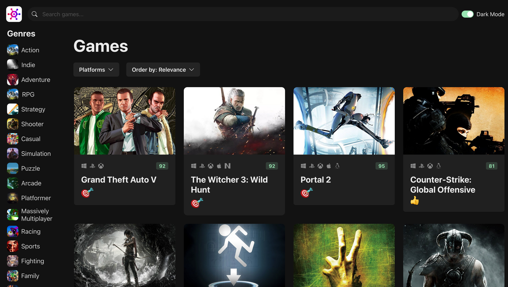

# 🎮 Game Hub

A modern and responsive web application for browsing and discovering video games.  
Built with **TypeScript**, **Vite**, and clean UI practices, Game Hub serves as a lightweight and fast game-exploration platform.

🌐 **Live Demo:** https://game-hub-eta-jade.vercel.app  
📦 **Repository:** https://github.com/knsxw/game-hub

---

## 🏷️ Badges


---

## 📖 Overview

Game Hub offers a clean and simple interface where users can:

- Explore available games
- View details such as title, genre, and description
- Navigate using a structured UI
- Enjoy a smooth, responsive web experience on all devices

This project was created as a TypeScript + Vite learning project and is easy to maintain, extend, and deploy.

---

## ✨ Features

- 🔍 **Game Browsing UI**
- ⚡ **Fast Vite Dev Server**
- 📱 **Responsive Layout**
- 🧩 **Modular Code Structure**
- 🚀 **Optimized Production Build**

---

## 🧰 Tech Stack

- **TypeScript** (97% of project)
- **HTML & CSS**
- **Vite**
- **Chkara UI**

---

## 📂 Project Structure

```
game-hub/
├── public/ # Static assets
├── src/ # Main application source
│ ├── components/ # UI components (if applicable)
│ ├── styles/ # CSS or style modules
│ ├── data/ # Local JSON / mock data (optional)
│ ├── main.ts # App entry file
│ └── ...
│
├── index.html # Root HTML
├── package.json
├── tsconfig.json
└── vite.config.ts # Vite configuration
```

---

## 🚀 Getting Started

### 1️⃣ Clone the repo

```bash
git clone https://github.com/knsxw/game-hub.git
cd game-hub
```

### 2️⃣ Install dependencies

```bash
npm install
```

### 3️⃣ Start development server

```bash
npm run dev
```

Visit: http://localhost:5173

### 4️⃣ Build for production

```bash
npm run build
```

## 🖼️ Screenshots



##🗺️ Roadmap

- Add game search
- Add filtering by genre
- Add animations and transitions
- Integrate external game API
- Dark mode

## 🤝 Contribution

### Contributions are welcomed!

- Fork the repo
- Create a new branch
- Commit changes
- Open a Pull Request
